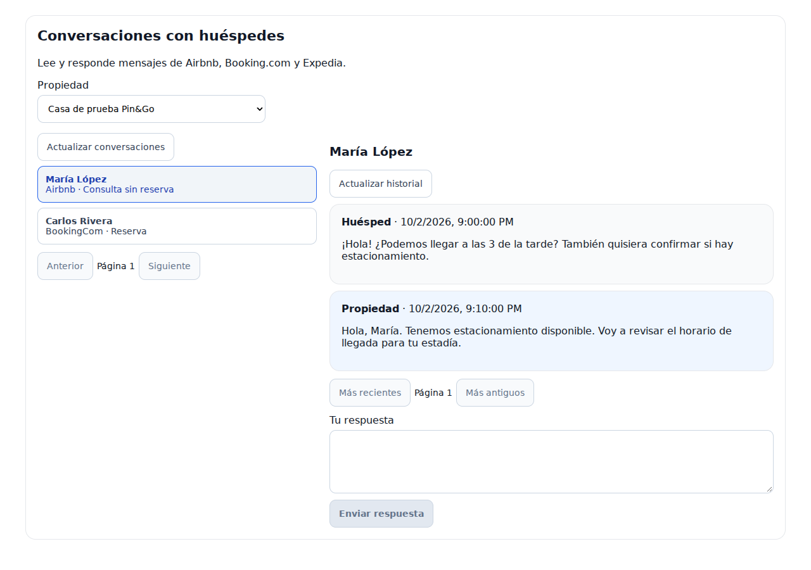
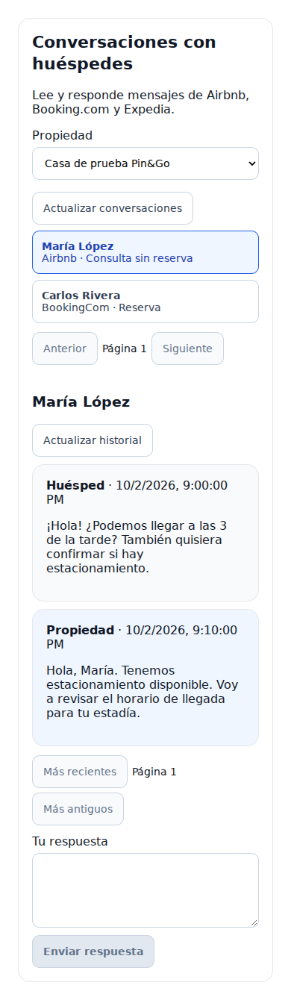
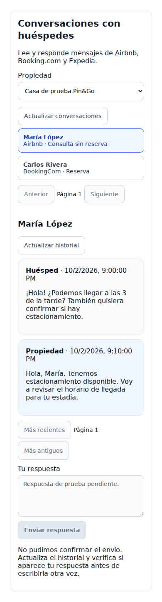

# Host inbox visual review — October 3, 2026

Reviewed the actual `ChannexInbox.tsx` component with the dashboard stylesheet in
Chromium at 1280×900 and 390×844. The standalone harness supplied synthetic
properties, threads and messages; it did not authenticate against the deployed
dashboard or contact Channex. This is a component visual review, not a staging
certification of the complete application.

## Results

- Property selection, Airbnb inquiry, Booking.com conversation, message history,
  composer and pagination render in desktop and mobile layouts.
- At 390 pixels the document width stays at 390 pixels, with no horizontal overflow.
- The browser recorded zero page errors and unhandled promise rejections.
- Submitting the composer produced exactly one synthetic POST and displayed
  confirmation. A simulated unknown outcome disabled the composer.
- Disabled runtime and empty conversation states display their explanatory text.
- Increased controls to a minimum height of 44 pixels, added visible keyboard
  focus, and used blue for the selected conversation, property replies and send button.
- Eight interaction/delivery-history tests, the strict inbox typecheck, ESLint and
  the Vite production build pass after the presentation changes.

The agent-browser CLI could not bind its daemon socket in the managed runtime.
The review used Chromium through Playwright's pipe transport inside the same
local test process network environment. No network permission was expanded.

## Live staging preparation

Read-only Railway inventory confirms the existing environment
`staging-channex-certification` in project `Pin&Go Deploy`.
Its `pin-go-api-staging` service currently runs
`agent/ota-connection-enterprise-recovery-local`, not the inbox branch.
The service has a `Postgres-Staging` instance and no pending Railway changes.
The configured predeploy command is `npx prisma migrate deploy`.

The service's defined variable-name list does not contain
`CHANNEX_HOST_INBOX_ENABLED` or `OTA_CONNECTION_VRBO_FILTER`. Those prerequisites
must be checked before activation; no secret values were retrieved for this review.
The literal configured healthcheck is `Healthcheck Path`; the effective setting
must also be checked against the service's railway.api.json before deployment.

Deployment, migration status preflight, selection of a controlled Channex staging
conversation and a real text reply are still pending. Do not treat the screenshot
or simulated send as evidence of actual OTA delivery.
